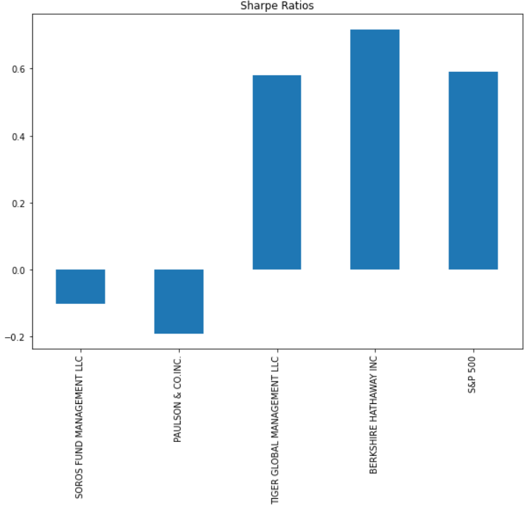

# Risk-Diversification
UW Fintech Bootcamp Module 4 Challenge Assignment

---

## Technologies

The following libraries are used in this analysis:  
  
  * pandas  
  * numpy
  * pathlib (Path only)
  * %matplotlib
  
---

## Purpose of Program

We have been tasked with evaluating various funds against the S&P 500 to understand which ones have upside, excessive risk,  
and ultimately select a fund to recommend to company for inclusion in our fund offerings.  
  
To analyze the funds we conducted the following calculations:  
  
  * Daily Return Performance  
  * Cumuative Returns  
  * Volatility
  * Standard Deviation
  * Annualized Standard Deviation (assuming 252 trading days)
  * Rolling averages
  * Sharpe Ratio
  * Beta analysis

---

## Conclusions

Through this exercise, we have recommended that our company add the Berkshire Hathaway Fund to our current offerings for clients.  
The first reason is due to their Sharpe Ratio.  As visualized in the image below, the BH Fund had a higher Sharpe Ratio than all other funds,  
including the S&P 500  

Additionally when we look at the 60 Rolling beta for BH vs the S&P 500 we see a lower variance, which means it is more likely to follow  
the same path as the S&P 500, which helps to mitigate the risk.

Summary Answer of Final 2 Questions:
Question 1 - Which of the two portfolios seem more sensitive to movements in the S&P 500?

Answer 1 - After looking at both Tiger Global Management and Berkshire Hathaway, it appears that Tiger Global, with a beta spread from -0.02 to 0.5 is more sensitive to the fluctuations of the S&P 500.

Question 2 - Which of the two portfolios do you recommend for inclusion in your firm’s suite of fund offerings?

Answer 2 - Since Bershire Hathaway has a lower beta variance, and had the highest Sharpe Ratio, then I would recommend adding that fund to our portfolio.

---

## Contributors

Special thanks to instructor, teaching assistants, and tutor for supporting me through various coding issues.

---

## License

Program is free to use without license.  Only request is that you notify author of use and application
